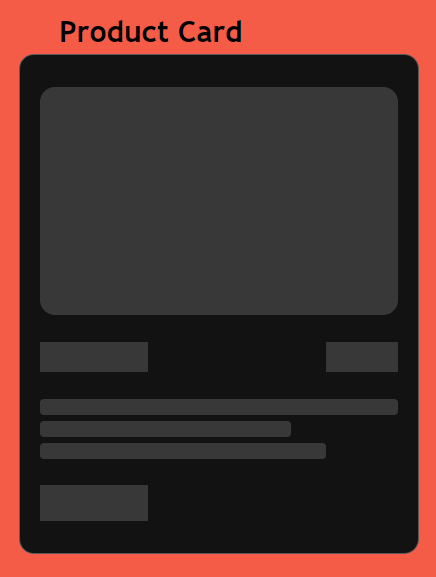
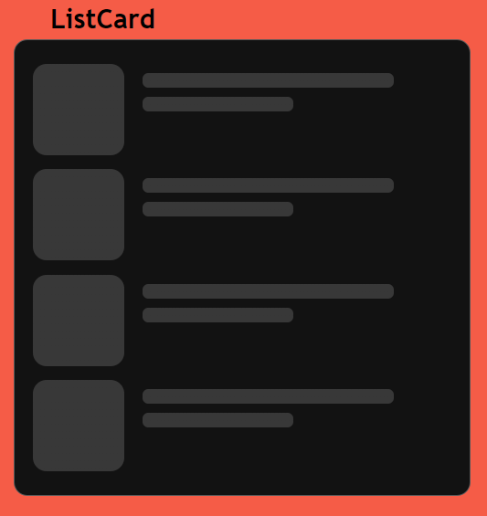
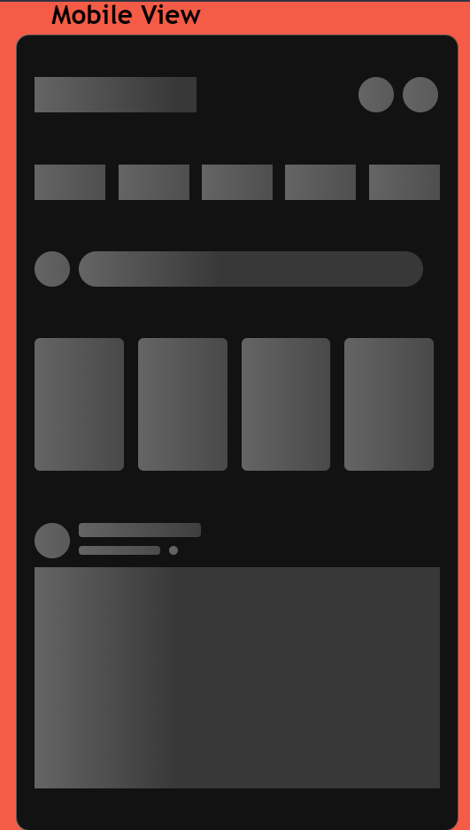
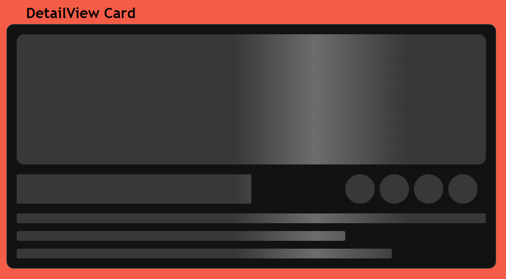
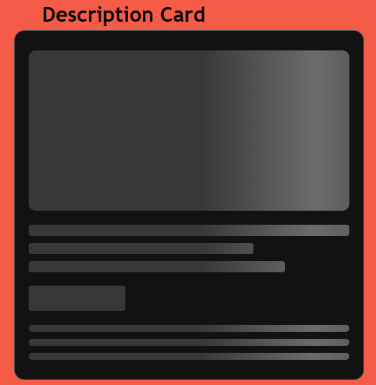

# [React Khatra Placeholder](https://mishankhatri.github.io/react-khatra-placeholder-docs)

[]()
[]()

## A react component library for creating skeleton placeholders

<p align="center">
 
</p>

## Installation

```bash
  npm install react-khatra-placeholder
```

## Documentation

### [React Khatra Placeholder Documentation](https://mishankhatri.github.io/react-khatra-placeholder-docs)

<br/>

## Requirement

- [React.js](https://reactjs.org) version 16 or above

<br/>

# Quick Start

## After installation

Import KhatraPlaceholder component from the react-khatra-placeholder.

```jsx
import { KhatraPlaceholder } from "react-khatra-placeholder";
```

```jsx
export const YourContentPage = () => {
  // your content loading logic.
  const [isLoading, setIsLoading] = useState(false);
  return (
    <>
      <KhatraPlaceholder
        isLoading={isLoading}
        type={"ParagraphPlaceholder"}
        delay={300}
        animateWave
      >
        <div>Your Beautiful content.</div>
      </KhatraPlaceholder>
    </>
  );
};
```

For Creating CustomPlaceholders import necessary components from the react-khatra-placeholder.

```jsx
import {
  KhatraPlaceholder,
  PCardContainer,
  PCard,
  PBlock,
  PInlineContainer,
  PLine,
} from "react-khatra-placeholder";
```

```jsx
const CustomPlaceholder = () => {
  return (
    <>
      {/* to hold more than one PCard. */}
      <PCardContainer>
        {/* base component of placeholder, control animation of placeholder from here.*/}
        <PCard w="400px" h="400px" animateWave>
          {/* creates rectangular block of given height and border radius.*/}
          <PBlock h="50%" br="8px" />
          {/* base component for creating paragraph lines.*/}
          <PInLineContainer gap="0.1rem" br="3px">
            <PLine h="0.8rem" /> {/* creates lines, just like in paragraphs.*/}
            <PLine w="70%" h="0.8rem" />
            <PLine w="80%" h="0.8rem" />
          </PInLineContainer>
          <PBlock w="30%" h="2rem" br="3px" />
        </PCard>
      </PCardContainer>
    </>
  );
};

export const YourContentPage = () => {
  // your content loading logic.
  const [isLoading, setIsLoading] = useState(false);
  return (
    <>
      <KhatraPlaceholder
        isLoading={isLoading}
        customPlaceholder={<CustomPlaceholder />}
        delay={300}
        animateWave
      >
        <div>Your Beautiful content.</div>
      </KhatraPlaceholder>
    </>
  );
};
```

# Components

## `KhatraPlaceholder`

KhatraPlaceholder is the base container to hold your content, maintain your loading state of your content , place custom placeholders and change animations.

```js
<KhatraPlaceholder>YourContent</KhatraPlaceholder>
```

| Property          | Type            | Required | Default value | Description                                                                                                                                          |
| :---------------- | :-------------- | :------- | :------------ | :--------------------------------------------------------------------------------------------------------------------------------------------------- |
| isLoading         | Boolean         | no       | false         | state to either hide or show content                                                                                                                 |
| delay             | Number          | no       | 0             | to add delay in between changing state from loading to loaded.(Use to omit fast flicker in faster network devices.)                                  |
| customPlaceholder | React Component | no       | null          | placeholder to show when content is loading                                                                                                          |
| type              | String          | no       | null          | type of builtin placeholders provided by the library either of "ListMediaPlaceholder","ProductPlaceholder","ImagePlaceholder","ParagraphPlaceholder" |
| animateWave       | Boolean         | no       | null          | to trigger shrimmer animation on placeholders                                                                                                        |
| animateGlow       | Boolean         | no       | null          | to trigger glow animation on placeholders                                                                                                            |
| style             | Object          | no       | null          | for custom css styling                                                                                                                               |
| className         | String          | no       | null          | for custom css class names                                                                                                                           |

## `PCardContainer`

PCardContainer is container to hold one or more PCard.

```js
<PCardContainer>{...children}<PCardContainer>
```

| Property  | Type   | Required | Default value | Description                |
| :-------- | :----- | :------- | :------------ | :------------------------- |
| className | String | no       | null          | for custom css class names |

## `PCard`

PCard is base container for creating card placeholders.<br/> Only place to control animations, either animateWave or animateGlow.

```js
<PCard>{...children}</PCard>
```

| Property    | Type    | Required | Default value       | Description                                |
| :---------- | :------ | :------- | :------------------ | :----------------------------------------- |
| w           | String  | yes      | null                | width of PCard                             |
| h           | String  | yes      | null                | height of PCard                            |
| br          | String  | no       | &quot;0.75rem&quot; | borderRadius of PCard                      |
| gap         | String  | no       | null                | gap between children                       |
| animateWave | Boolean | no       | null                | to trigger shrimmer animation on childrens |
| animateGlow | Boolean | no       | null                | to trigger glow animation on childrens     |
| style       | Object  | no       | null                | for custom css styling                     |
| className   | String  | no       | null                | for custom css class names                 |

> Note: using both animateWave and animateGlow stops animation.

## `PBlock`

PBlock is used for creating placeholders for titles ,images and badges.

```js
<PBlock />
```

| Property  | Type    | Required | Default value       | Description                                                                     |
| :-------- | :------ | :------- | :------------------ | :------------------------------------------------------------------------------ |
| w         | String  | no       | &quot;100%&quot;    | width of PBlock                                                                 |
| h         | String  | no       | &quot;100%&quot;    | height of PBlock                                                                |
| br        | String  | no       | &quot;0.75rem&quot; | borderRadius of PBlock                                                          |
| align     | String  | no       | null                | to align-self inside PCard, takes either of values flex-start,flex-end & center |
| rounded   | Boolean | no       | null                | to create cicles                                                                |
| style     | Object  | no       | null                | for custom css styling                                                          |
| className | String  | no       | null                | for custom css class names                                                      |

## `PInlineContainer`

PInlineContainer is parent container to hold PLine component.
Without PInlineContainer, PLine cannot be rendered.

```js
<PInlineContainer>{...children}</PInlineContainer>
```

| Property   | Type   | Required | Default value           | Description                                                                                                          |
| :--------- | :----- | :------- | :---------------------- | :------------------------------------------------------------------------------------------------------------------- |
| w          | String | no       | &quot;100%&quot;        | width of PInlineContainer                                                                                            |
| h          | String | no       | &quot;fit-content&quot; | height of PInlineContainer                                                                                           |
| br         | String | no       | &quot;5px&quot;         | borderRadius for each children                                                                                       |
| gap        | String | no       | &quot;0.5rem&quot;      | gap between chilrens PInlineContainer                                                                                |
| justify    | String | no       | null                    | to justify PLines,PBlock inside PInlineContainer takes either of space-between, space-around, space-evenly & centerr |
| rows       | Number | no       | null                    | to create given number of rows of PLines                                                                             |
| rowsWidth  | String | no       | null                    | to specify width for given number of 'rows'                                                                          |
| rowsHeight | String | no       | null                    | to specify height for given number of 'rows'                                                                         |
| style      | Object | no       | null                    | for custom css styling                                                                                               |
| className  | String | no       | null                    | for custom css class names                                                                                           |

## `PLine`

PLine is used to create placeholders for texts.
Used with parent PInLineContainer

```js
<PLine />
```

| Property  | Type   | Required | Default value    | Description                                                                                |
| :-------- | :----- | :------- | :--------------- | :----------------------------------------------------------------------------------------- |
| w         | String | no       | &quot;100%&quot; | width of PLine                                                                             |
| h         | String | no       | &quot;1rem&quot; | height of PLine                                                                            |
| br        | String | no       | null             | borderRadius                                                                               |
| align     | String | no       | null             | to align-self inside PInlineContainer, takes either of values flex-start,flex-end & center |
| style     | Object | no       | null             | for custom css styling                                                                     |
| className | String | no       | null             | for custom css class names                                                                 |

<br>

# Builtin Types

## type: `ParagraphPlaceholder`

```js
<ParagraphPlaceholder />
```

| Property    | Type    | Required | Default value       | Description                                |
| :---------- | :------ | :------- | :------------------ | :----------------------------------------- |
| w           | String  | no       | &quot;80%&quot;     | width of placeholder.                      |
| h           | String  | no       | &quot;20%&quot;     | height of placeholder                      |
| br          | String  | no       | &quot;0.25rem&quot; | borderRadius                               |
| animateWave | Boolean | no       | null                | to trigger shrimmer animation on childrens |
| animateGlow | Boolean | no       | null                | to trigger glow animation on childrens     |
| rows        | Number  | no       | 7                   | total rows of lines in paragraph           |
| rowsHeight  | String  | no       | &quot;0.75rem&quot; | height of lines in paragraph.              |
| rowsWidth   | String  | no       | &quot;100%&quot;    | width of lines in paragraph.               |
| style       | Object  | no       | null                | for custom css styling                     |
| className   | String  | no       | null                | for custom css class names                 |

## type: `ProductPlaceholder`

```js
<ProductPlaceholder />
```

| Property    | Type    | Required | Default value       | Description                                |
| :---------- | :------ | :------- | :------------------ | :----------------------------------------- |
| w           | String  | no       | &quot;20rem&quot;   | width of placeholder.                      |
| h           | String  | no       | &quot;25rem&quot;   | height of placeholder                      |
| br          | String  | no       | &quot;0.25rem&quot; | borderRadius                               |
| style       | Object  | no       | null                | for custom css styling                     |
| animateWave | Boolean | no       | null                | to trigger shrimmer animation on childrens |
| animateGlow | Boolean | no       | null                | to trigger glow animation on childrens     |
| className   | String  | no       | null                | for custom css class names                 |

## type: `ImagePlaceholder`

```js
<ImagePlaceholder />
```

| Property    | Type    | Required | Default value       | Description                                |
| :---------- | :------ | :------- | :------------------ | :----------------------------------------- |
| w           | String  | no       | &quot;25rem&quot;   | width of placeholder.                      |
| h           | String  | no       | &quot;25rem&quot;   | height of placeholder                      |
| br          | String  | no       | &quot;0.25rem&quot; | borderRadius                               |
| style       | Object  | no       | null                | for custom css styling                     |
| animateWave | Boolean | no       | null                | to trigger shrimmer animation on childrens |
| animateGlow | Boolean | no       | null                | to trigger glow animation on childrens     |
| className   | String  | no       | null                | for custom css class names                 |

## type: `ListMediaPlaceholder`

```js
<ListMediaPlaceholder />
```

| Property    | Type    | Required | Default value       | Description                                |
| :---------- | :------ | :------- | :------------------ | :----------------------------------------- |
| w           | String  | no       | &quot;50%&quot;     | width of placeholder.                      |
| h           | String  | no       | &quot;20%&quot;     | height of placeholder                      |
| br          | String  | no       | &quot;0.75rem&quot; | borderRadius                               |
| style       | Object  | no       | null                | for custom css styling                     |
| animateWave | Boolean | no       | null                | to trigger shrimmer animation on childrens |
| animateGlow | Boolean | no       | null                | to trigger glow animation on childrens     |
| className   | String  | no       | null                | for custom css class names                 |

<br>

# Themes

## PThemeProvider

PThemeProvider is the component to pass your theme colors and state.
Maintains own theme state with boolean state : darkTheme and handler:handleTheme and defaults to light theme.
Access darkTheme, handleTheme via `useTheme()`

```jsx
//for providing darkTheme state and handler globally
import { PThemeProvider } from "react-khatra-placeholder";

return (
  <PThemeProvider
    lightModeBackground="orange"
    lightModeColor="brown"
    darkModeBackground="lightgreen"
    darkModeColor="green"
    darkModeShine="lightblue"
  >
    <YourTopParentComponentPage />
  </PThemeProvider>
);
```

| Property            | Type   | Required | Default value                | Description                                             |
| :------------------ | :----- | :------- | :--------------------------- | :------------------------------------------------------ |
| lightModeColor      | String | no       | DEFAULT_LIGHTMODE_LINE_COLOR | light mode color of placeholder lines and blocks.       |
| darkModeColor       | String | no       | DEFAULT_DARKMODE_LINE_COLOR  | dark mode color of placeholder lines and blocks.        |
| lightModeBackground | String | no       | DEFAULT_LIGHTMODE_BG_COLOR   | light mode background color of placeholder cards.       |
| darkModeBackground  | String | no       | DEFAULT_DARKMODE_BG_COLOR    | light mode background color of placeholder cards.       |
| lightModeShine      | String | no       | DEFAULT_LIGTHMODE_SHINE      | light mode shine color of placeholder lines and blocks. |
| darkModeShine       | String | no       | DEFAULT_DARKMODE_SHINE       | light mode shine color of placeholder lines and blocks. |

`DEFAULT_LIGHTMODE_LINE_COLOR = "#d7d7d7"` <br/>
`DEFAULT_DARKMODE_LINE_COLOR = "#383838"` <br/>
`DEFAULT_LIGHTMODE_BG_COLOR = "#ffffff"` <br/>
`DEFAULT_DARKMODE_BG_COLOR = "#121212"` <br/>
`DEFAULT_LIGTHMODE_SHINE = "#eeeeee"` <br/>
`DEFAULT_DARKMODE_SHINE = "#6d6c6c"` <br/>

## `useTheme()`

For accessing `useTheme()` hook:

```jsx
import { useTheme } from "react-khatra-placeholder";

const { darkTheme, handleTheme } = useTheme();
return <button onClick={() => handleTheme(!darkTheme)}>Toggle Theme</button>;
```

# `Custom Cards used in Demo`

`Profile Card` :

<p align="">
 
</p>

```js
<PCard w="400px" h="500px" br="12px" animateWave>
  <PBlock w="100%" h="150px" br="12px" align="center" />
  <PInLineContainer justify="center">
    <PBlock
      w="100px"
      h="100px"
      rounded
      align="center"
      style={{
        position: "relative",
        top: "-5rem",
        marginBottom: "-5rem",
        border: "2px solid grey",
      }}
    />
    <PBlock w="75%" h="1rem" align="center" />
    <PBlock w="60%" h="0.8rem" align="center" />
    <PBlock w="60%" h="0.8rem" align="center" />
  </PInLineContainer>
  <PInLineContainer justify="center">
    <PBlock w="40%" h="2rem" />
    <PBlock w="40%" h="2rem" />
    <PBlock w="10%" h="2rem" />
  </PInLineContainer>
  <PInLineContainer gap="0.8rem" justify="center">
    <PLine w="20%" h="100px" />
    <PLine w="20%" h="100px" />
    <PLine w="20%" h="100px" />
    <PLine w="20%" h="100px" />
  </PInLineContainer>
</PCard>
```

`Product Card` :

<p align="">
 
</p>

```js
<PCard w="320px" h="400px" animateWave>
  <PBlock h="50%" br="12px" />
  <PInLineContainer justify="space-between">
    <PBlock w="30%" h="1.5rem" />
    <PBlock w="20%" h="1.5rem" />
  </PInLineContainer>
  <PInLineContainer gap="0.3rem" br="3px">
    <PLine h="0.8rem" />
    <PLine w="70%" h="0.8rem" />
    <PLine w="80%" h="0.8rem" />
  </PInLineContainer>
  <PBlock w="30%" h="1.8rem" />
</PCard>
```

`List Card` :

<p align="">
 
</p>

```js
<PCard w="400px" h="400px" animateWave>
  <PInLineContainer gap="1rem">
    <PBlock w="80px" h="80px" br="12px" />
    <PInLineContainer w="60%" style={{ marginTop: "0.5rem" }}>
      <PLine w="100%" h="0.8rem" />
      <PLine w="60%" h="0.8rem" />
    </PInLineContainer>
  </PInLineContainer>
  <PInLineContainer gap="1rem">
    <PBlock w="80px" h="80px" br="12px" />
    <PInLineContainer w="60%" style={{ marginTop: "0.5rem" }}>
      <PLine w="100%" h="0.8rem" />
      <PLine w="60%" h="0.8rem" />
    </PInLineContainer>
  </PInLineContainer>
  <PInLineContainer gap="1rem">
    <PBlock w="80px" h="80px" br="12px" />
    <PInLineContainer w="60%" style={{ marginTop: "0.5rem" }}>
      <PLine w="100%" h="0.8rem" />
      <PLine w="60%" h="0.8rem" />
    </PInLineContainer>
  </PInLineContainer>
  <PInLineContainer gap="1rem">
    <PBlock w="80px" h="80px" br="12px" />
    <PInLineContainer w="60%" style={{ marginTop: "0.5rem" }}>
      <PLine w="100%" h="0.8rem" />
      <PLine w="60%" h="0.8rem" />
    </PInLineContainer>
  </PInLineContainer>
</PCard>
```

`Mobile View` :

<p align="">
 
</p>

```js
<PCard w="400px" h="720px" animateGlow>
  <PInLineContainer justify="space-between">
    <PBlock w="40%" h="2rem" />
    <PInLineContainer w="20%">
      <PBlock w="2rem" h="2rem" rounded />
      <PBlock w="2rem" h="2rem" rounded />
    </PInLineContainer>
  </PInLineContainer>

  <PInLineContainer justify="space-between">
    <PBlock w="4rem" h="2rem" />
    <PBlock w="4rem" h="2rem" />
    <PBlock w="4rem" h="2rem" />
    <PBlock w="4rem" h="2rem" />
    <PBlock w="4rem" h="2rem" />
  </PInLineContainer>

  <PInLineContainer>
    <PBlock w="2rem" h="2rem" rounded />
    <PLine w="85%" h="2rem" br="18px" />
  </PInLineContainer>

  <PInLineContainer gap="0.8rem">
    <PLine w="22%" h="120px" />
    <PLine w="22%" h="120px" />
    <PLine w="22%" h="120px" />
    <PLine w="22%" h="120px" />
  </PInLineContainer>

  <PInLineContainer>
    <PBlock w="2rem" h="2rem" rounded />
    <PInLineContainer w="50%">
      <PLine w="60%" h="0.8rem" br="3px" />
      <PLine w="40%" h="0.5rem" br="3px" />
      <PBlock w="0.5rem" h="0.5rem" rounded />
    </PInLineContainer>
    <PBlock h="300px" />
  </PInLineContainer>
</PCard>
```

`Details Card` :

<p align="">
 
</p>

```js
<PCard w="800px" h="400px" gap="1rem" animateGlow>
  <PBlock h="100%" br="12px" />
  <PInLineContainer align="space-between">
    <PBlock w="50%" h="3rem" />
    <PInLineContainer w="30%">
      <PBlock w="3rem" h="3rem" rounded />
      <PBlock w="3rem" h="3rem" rounded />
      <PBlock w="3rem" h="3rem" rounded />
      <PBlock w="3rem" h="3rem" rounded />
    </PInLineContainer>
  </PInLineContainer>
  <PInLineContainer gap="0.8rem" br="3px">
    <PLine h="1rem" />
    <PLine w="70%" h="1rem" />
    <PLine w="80%" h="1rem" />
  </PInLineContainer>
</PCard>
```

`Description Card` :

<p align="">
 
</p>

```js
<PCard w="400px" h="400px" animateGlow>
  <PBlock h="50%" br="8px" />
  <PInLineContainer gap="0.5rem" br="3px">
    <PLine h="0.8rem" />
    <PLine w="70%" h="0.8rem" />
    <PLine w="80%" h="0.8rem" />
  </PInLineContainer>
  <PBlock w="30%" h="1.8rem" br="3px" />
</PCard>
```

## Authors

- [@MishanKhatri](https://github.com/Mishankhatri)

## Contribution

Feel free to contribute. Happy Coding!
